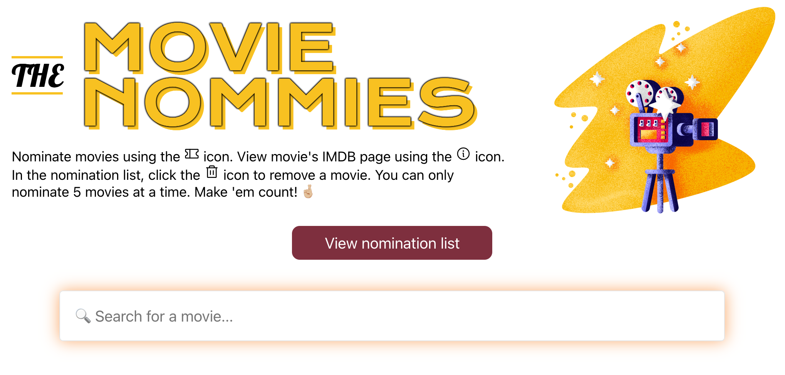

# The Movie Nommies 🍿
  A take on Shopify's 'Shoppies' challenge.
  Check out the live demo [here](https://movie-nommies.netlify.app).

## Challenge description 🧠
Use the [OMDB](http://www.omdbapi.com/) API to search for movies, and allow the user to nominate a maximum of 5 movies. Once they've reached the cap, they should be notified.

## Challenge requirements 🧗🏻‍♀️
- Search results should come from OMDB's API (free API key: http://www.omdbapi.com/apikey.aspx).
- Each search result should list at least its title, year of release and a button to nominate that film.
- Updates to the search terms should update the result list
- Movies in search results can be added and removed from the nomination list.
- If a search result has already been nominated, disable its nominate button.
- Display a banner when the user has 5 nominations.

## Installation guide 👩🏻‍💻
Super simple steps!
- `git clone` this repository into your preferred local directory
- `cd` into said directory
- run `yarn` to install all project dependencies
- `yarn start` to run the project!

<br />

## About my take 🎉

I actually began this challenge in September of 2020 for the January 2021 internship. At that point, I only worked on the header, but was too anxious to continue on (imposter syndrome at its finest). 

However, I was on a mission to actually complete the task this time around, and was proud of myself for doing so. That is why you may see code that was written in September 2020.


### Language & framework  🌏
Since this was a web development challenge, I used JavaScript. 
I built the project using React.js due to my familiarity with it, and because it's my favourite library to use when consuming and displaying API data. I used its Context API to have a persistent state throughout the lifecycle of the app, enabling a better way to pass data between components. 

### Nomination storage 💾
I used LocalStorage to store user nominations based on the user's browser cache. At first I did use Firebase instead of LocalStorage, however quickly realized it wasn't as user-friendly, since users were able to see nominations straight from the database rather than their own on page load. Not to mention anyone was able to see another nominate and delete movies. 

### Styling 🎨
I used SASS as my CSS extension due to its modularity, functions (used for mixins and media queries), and variables (used for colours and fonts).

### Tech stack 🥞
- [React](https://reactjs.org/)
  - [Hooks (useEffect, useState, useContext, createContext)](https://reactjs.org/docs/hooks-intro.html)
  - [Context API](https://reactjs.org/docs/context.html#gatsby-focus-wrapper)
- [SASS (styling)](https://sass-lang.com/)
- [react-animations](https://www.npmjs.com/package/react-animations)
- [Phosphor Icons (nice and cute icons)](https://phosphoricons.com/)
- [Local Storage](https://developer.mozilla.org/en-US/docs/Web/API/Window/localStorage)
- [Axios (API fetching)](https://www.npmjs.com/package/axios)
- [Netlify (deploy & hosting)](https://www.netlify.com/)
  
### Folder structure 🗃️
I made sure to make the folder structure pretty understandable and straight forward

```
+-- src
|   +-- assets
|   |   +-- images
|   +-- styles
|   |   organized styles (SASS)
|   +-- components
|   |   +-- context folder
|   |   |   +-- context API file
|   |   +-- organized component files
|   +-- App.js (holds all the component files)
```

### Layout 🏞️

#### Header & description
I wanted to make the web app as simple as possible. I included a small description in the header describing how a user is to search, nominate, and delete a movie. I made sure to add a button that would open and close the nominations modal for easy access.  I also added a little fun treat of allowing the user to quickly hop into the movie's [Imdb](https://www.imdb.com/) page.


(header image by <a href="https://dribbble.com/RazvanVezeteu?page=2">Razvan</a>)

<br />
<br />

#### Movie searches
The search results will display dynamically, meaning they will change upon whatever the user types per letter.

I made the movies show as 3-dimensional-ish cards that have the movie title, release year, nomination button, and Imdb button.


Yeah I like Twilight, so what?! 👀


#### Nomination modal
The nomination modal will be opened on page load _if_ there are already movies the local users has nominated previously. If there are none, then the modal won't be open on page load.

To view nominations, the user can click on the button above that says `Open nomination list`, and can close it clicking the same button (which at that point will say `Close nomination list`)

Once a user nominates a movie, the modal will automatically open showing an animation of a movie sliding up and being nominated (fun!).

If the user chooses to delete all the movies they've nominated, then the modal will automatically close.

I decided to make the nomination list appear in a small modal with a clear background, with a button on top that can also close it, and the user can also press the `esc` key to close it!


<br/>
<br />

When the user nominates 5 movies, nomination buttons on all movies will be disabled, and a banner will appear on top of the page notifying the user. However, user can reverse the disabled buttons by deleting one movie from the nomination list.

